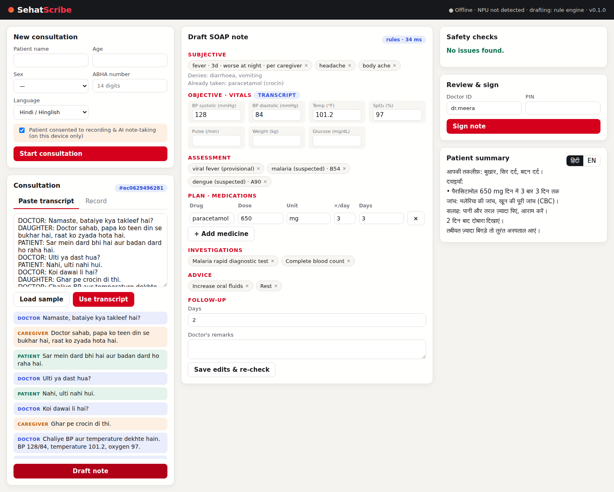

# SehatScribe

**Offline, multilingual AI clinical scribe for India's outpatient clinics, built for Snapdragon®-powered HP AI PCs.**

SehatScribe listens to a doctor–patient–caregiver consultation in Hindi, Hinglish or English, drafts a structured SOAP note with prescription, tests, advice and follow-up, checks it for safety, and lets the doctor sign it. It then exports a FHIR R4 record for the patient's ABHA health account and prints a summary in the patient's language. Everything runs on the device.

> Built for the **Snapdragon AI Lab Build & Present Challenge**. See the [product brief](docs/PRODUCT_BRIEF.md).



## Why on-device

| | Cloud AI scribe | SehatScribe on Snapdragon |
|---|---|---|
| Patient audio leaves the clinic | Yes | **No** |
| Works without internet | No | **Yes** |
| Per-consult API cost | Yes | **None** |
| Battery through an OPD shift | — | **NPU offload** |

## Features (v0.1)

- **Triadic, multilingual understanding.** Separates doctor, patient and caregiver; handles Hinglish, Devanagari, Hindi number words and pertinent negatives ("ulti nahi hui").
- **SOAP drafting.** Symptoms with duration and modifiers, vitals, suspected/provisional/confirmed diagnoses (SNOMED CT, ICD-10), medication orders, investigations, advice, follow-up.
- **Three drafting engines.** Deterministic rule engine (default, any CPU); **Llama 3.2 3B on the Hexagon NPU via Qualcomm Genie**; ONNX Runtime GenAI (QNN or CPU). Automatic fallback.
- **Safety layer.** Grounding filter removes anything not actually said; dose-range checks; condition rules (e.g. NSAIDs flagged in suspected dengue).
- **Doctor in control.** Editable note, PIN sign-off, signed notes immutable.
- **Interoperable output.** FHIR R4 document bundle modelled on ABDM's OPConsult record (LOINC vitals, SNOMED CT, ICD-10).
- **Patient summary** in Hindi or English, printable.
- **Privacy.** Consent gate, audio deleted after transcription, encrypted local database, audit log.
- **Arduino UNO Q vitals pod.** Reference app streams BP/SpO₂/pulse/temperature into the note; a simulator is included.

## Quick start

Requires Python 3.10+.

```bash
git clone https://github.com/<your-username>/sehatscribe.git
cd sehatscribe
python -m venv .venv && .venv\Scripts\activate      # Windows  (source .venv/bin/activate on macOS/Linux)
pip install -e ".[dev]"

# 1. Try the pipeline on a sample consultation
sehatscribe demo samples/consult_fever_hinglish.txt --fhir opconsult.json

# 2. Run the web app
sehatscribe serve                      # open http://127.0.0.1:8000
```

On first launch the app asks you to create the doctor who signs notes (ID, name, PIN). Then: **Start consultation → Load sample → Use transcript → Draft note → Sign**.

### Optional: speech-to-text

```bash
pip install -r requirements-asr.txt   # faster-whisper; use the Record tab or upload audio
```

### Optional: Snapdragon NPU

See **[docs/NPU_SETUP.md](docs/NPU_SETUP.md)** to run Llama 3.2 3B from Qualcomm AI Hub on the Hexagon NPU with Genie. Check what the app detects:

```bash
sehatscribe runtime
```

### Optional: vitals pod

```bash
# On the PC
set SEHAT_DEVICE_TOKEN=choose-a-secret
sehatscribe serve --host 0.0.0.0

# From another terminal (or flash edge/uno_q_vitals_pod to an Arduino UNO Q)
python edge/simulate_pod.py --url http://127.0.0.1:8000 --token choose-a-secret
```

## Example output

```
S  Symptoms:
   - fever (3 days; worse at night; per caregiver)
   - headache (per patient)
   - body ache (per patient)
   Denies: diarrhoea, vomiting
   Already taken: paracetamol (crocin)
O  Vitals: bp_systolic=128, bp_diastolic=84, temperature_f=101.2, spo2=97
A  viral fever [provisional]; malaria [suspected]; dengue [suspected]
P  Medications:
   - paracetamol 650 mg 3x/day x 3 days
   Investigations: Malaria rapid diagnostic test, Complete blood count
   Advice: Increase oral fluids, Rest
   Follow-up: 2 days
```

## Configuration

| Variable | Default | Purpose |
|---|---|---|
| `SEHAT_LLM` | `auto` | `auto`, `rules`, `genie`, `ort-genai` |
| `SEHAT_GENIE_CONFIG` | – | Path to the AI Hub Genie bundle's `genie_config.json` |
| `SEHAT_GENIE_EXE` | `genie-t2t-run` | Genie CLI executable |
| `SEHAT_ORT_MODEL_DIR` | – | ONNX Runtime GenAI model folder |
| `SEHAT_WHISPER_MODEL` | `small` | faster-whisper model size or path |
| `SEHAT_DATA_DIR` | `%LOCALAPPDATA%\SehatScribe` or `~/.sehatscribe` | Encrypted database and key |
| `SEHAT_DEVICE_TOKEN` | – | Shared secret for the vitals pod |

## Benchmarks

```bash
python scripts/benchmark.py                   # rule engine
python scripts/benchmark.py --engine genie    # NPU
python scripts/benchmark.py --audio consult.wav
```

Targets on HP OmniBook X (Snapdragon X Elite): ASR real-time factor ≤ 0.2, LLM ≥ 15 tokens/s, consult end → draft ≤ 30 s. Replace this line with your measured results.

## Project layout

```
sehatscribe/        core package (pipeline, engines, safety, FHIR, API, web UI)
edge/               Arduino UNO Q vitals pod + simulator
samples/            sample consultations (Hinglish, labelled and unlabelled)
scripts/            benchmark
tests/              pytest suite (28 tests)
docs/               product brief, architecture, NPU setup
```

## Tests

```bash
pytest -q
```

## Status and limitations

This is an MVP for a challenge submission, **not a medical device**. It documents what the clinician says and does not diagnose or recommend treatment.

- Dose limits in `sehatscribe/data/safety_rules.json` and the SNOMED CT / ICD-10 mappings are illustrative. They must be validated against the state's Standard Treatment Guidelines and the SNOMED CT India release before clinical use.
- The rule engine covers a starter lexicon of common OPD conditions; the LLM engine broadens coverage.
- NPU speech-to-text, pyannote diarization, IndicTrans2 translation, Windows Hello sign-off and ABDM gateway push are on the roadmap.

## Roadmap

- Whisper and pyannote on the Hexagon NPU (ONNX Runtime QNN EP)
- 10 Indian languages via IndicTrans2
- ABDM sandbox integration and NRCES FHIR profile conformance
- Windows Hello sign-off; DPAPI-protected keys
- MSIX installer

## Author

**Harsh Agrawal**, MBA, Indian Institute of Management Sirmaur. Built for the Snapdragon AI Lab Build & Present Challenge 2026.

## Licence

Code: MIT (see `LICENSE`). Models are licensed separately by their owners (Llama 3.2: Meta community licence; Whisper: MIT).
